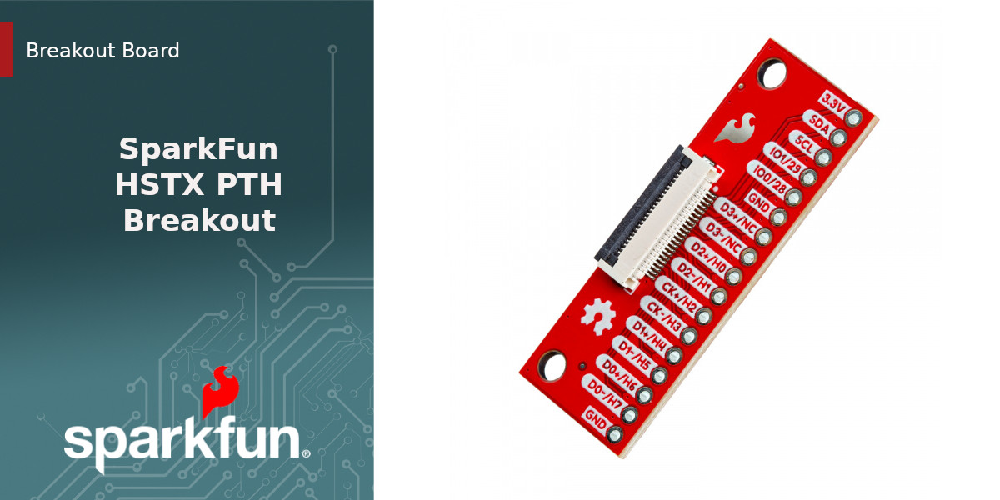

SparkFun HSXT PTH Breakout
========================================

[*SparkFun HSTX PTH Breakout (BOB-28467)*](https://www.sparkfun.com/sparkfun-hstx-pth-breakout.html)

The SparkFun HSTX PTH Breakout is a simple board designed to work with the HSTX connector on the IoT RedBoard - RP2350 and the camera and display connectors on a Rasbperry Pi 5. It breaks out all 22 of the pins used on these connectors to a standard 0.1"-spaced plated through hole header. These 22-pin connectors interface with a matching flexible cable and normally connect directly to other peripherals (cameras, displays, etc.).

Intended for prototyping with the IoT RedBoard - RP2350, this board breaks out all four differential pairs on the connector along with I2C signals (data/clock) and power (3.3V & Ground). 

Repository Contents
-------------------

* **/Hardware** - Eagle design files (.brd, .sch)

Product Versions
----------------
* [BOB-28467](https://www.sparkfun.com/sparkfun-hstx-pth-breakout.html) - HSXT to PTH Breakout

License Information
-------------------

This product is _**open source**_! 

Please review the LICENSE.md file for license information. 

If you have any questions or concerns on licensing, please contact technical support on our [SparkFun forums](https://forum.sparkfun.com/viewforum.php?f=152).

Distributed as-is; no warranty is given.

- Your friends at SparkFun.
